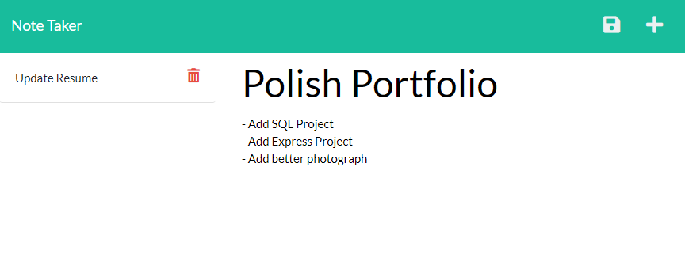

# Note Taker

## Description 
This app allows users to take notes, save them to a database, and then access them again at any time.

## Table of Contents

1. [Installation](#installation)
2. [Usage](#usage)
3. [License](#license)
4. [Contributing](#contributing)
5. [Tests](#tests)
6. [Questions](#questions)

## Installation
If you wish to install this app, you will need to install node.js and npm. Then, clone this repo. Otherwise you can access it at the following URL: https://note-taker-chillaroo.herokuapp.com/ 

## Usage
Press the "Get Started" button. Then, click on the "Note Title" and "Note Text" areas to enter your note. You will see a "Save" icon appear in the upper right corner. Click on it to save your note, and you will see it appear on the left column. If you wish to delete it, just press the "Trash" icon.

## License
This application is covered under the MIT License.

## Contributing
This application is not accepting contributions at this time.

## Tests
No tests have been written for this application at this time.

## Questions
You can reach me with questions at rtc145@gmail.com or view my github page at https://github.com/Chillaroo.